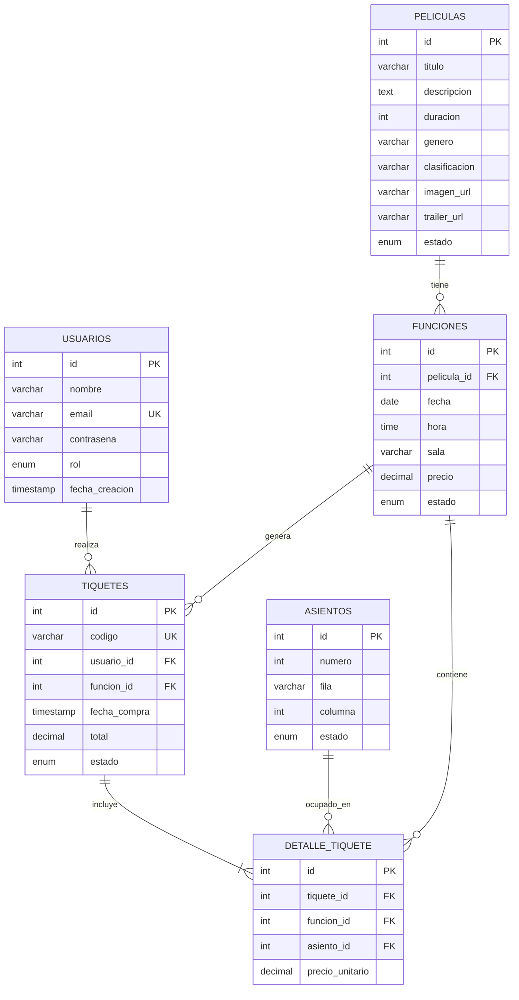

# 📊 Modelo de Base de Datos - CineMax

## Diagrama Entidad-Relación



---

## 📋 Descripción de Entidades

### 1. USUARIOS
Almacena la información de los usuarios registrados en el sistema.

| Atributo | Tipo | Restricciones | Descripción |
|----------|------|---------------|-------------|
| `id` | INT | PRIMARY KEY, AUTO_INCREMENT | Identificador único del usuario |
| `nombre` | VARCHAR(100) | NOT NULL | Nombre completo del usuario |
| `email` | VARCHAR(100) | UNIQUE, NOT NULL | Correo electrónico (usado para login) |
| `contrasena` | VARCHAR(255) | NOT NULL | Contraseña encriptada con Werkzeug |
| `rol` | ENUM | DEFAULT 'cliente' | Rol del usuario: 'admin' o 'cliente' |
| `fecha_creacion` | TIMESTAMP | DEFAULT CURRENT_TIMESTAMP | Fecha de registro |

**Notas:**
- El campo `contrasena` almacena el hash generado por `generate_password_hash()`
- El rol 'admin' tiene acceso a todas las funcionalidades administrativas
- Se incluye un usuario admin por defecto: admin@cine.com / admin123

---

### 2. PELICULAS
Contiene el catálogo de películas disponibles en el cine.

| Atributo | Tipo | Restricciones | Descripción |
|----------|------|---------------|-------------|
| `id` | INT | PRIMARY KEY, AUTO_INCREMENT | Identificador único de la película |
| `titulo` | VARCHAR(150) | NOT NULL | Título de la película |
| `descripcion` | TEXT | NULL | Sinopsis o descripción |
| `duracion` | INT | NOT NULL | Duración en minutos |
| `genero` | VARCHAR(50) | NULL | Género cinematográfico |
| `clasificacion` | VARCHAR(20) | NULL | Clasificación por edad (Ej: +12, +18) |
| `imagen_url` | VARCHAR(255) | NULL | URL de la imagen promocional |
| `trailer_url` | VARCHAR(255) | NULL | URL del tráiler (YouTube, etc.) |
| `estado` | ENUM | DEFAULT 'activa' | Estado: 'activa' o 'inactiva' |

**Relaciones:**
- Una película puede tener **múltiples funciones** (1:N)
- Si una película tiene funciones activas, no puede ser eliminada

---

### 3. FUNCIONES
Representa las proyecciones programadas de cada película.

| Atributo | Tipo | Restricciones | Descripción |
|----------|------|---------------|-------------|
| `id` | INT | PRIMARY KEY, AUTO_INCREMENT | Identificador único de la función |
| `pelicula_id` | INT | FOREIGN KEY, NOT NULL | Referencia a la película |
| `fecha` | DATE | NOT NULL | Fecha de la proyección |
| `hora` | TIME | NOT NULL | Hora de inicio |
| `sala` | VARCHAR(50) | DEFAULT 'Sala 1' | Identificador de la sala |
| `precio` | DECIMAL(10,2) | NOT NULL | Precio por asiento |
| `estado` | ENUM | DEFAULT 'disponible' | Estado: 'disponible' o 'cancelada' |

**Relaciones:**
- Cada función pertenece a **una película** (N:1)
- Una función puede generar **múltiples tiquetes** (1:N)
- Una función puede tener **múltiples detalles de tiquete** (asientos ocupados) (1:N)

**Comportamiento:**
- Al eliminar una película, se eliminan en cascada todas sus funciones
- Las funciones canceladas no permiten nuevas compras
- No se puede cancelar una función que ya tiene tiquetes vendidos

---

### 4. ASIENTOS
Catálogo de asientos disponibles en la sala de cine.

| Atributo | Tipo | Restricciones | Descripción |
|----------|------|---------------|-------------|
| `id` | INT | PRIMARY KEY, AUTO_INCREMENT | Identificador único del asiento |
| `numero` | INT | NOT NULL | Número secuencial del asiento (1-150) |
| `fila` | VARCHAR(5) | NOT NULL | Letra de la fila (A-J) |
| `columna` | INT | NOT NULL | Número de columna (1-15) |
| `estado` | ENUM | DEFAULT 'activo' | Estado: 'activo' o 'inactivo' |

**Características:**
- La sala tiene **150 asientos** distribuidos en:
  - **10 filas**: A, B, C, D, E, F, G, H, I, J
  - **15 columnas**: 1 al 15
- Los asientos se generan automáticamente mediante el procedimiento almacenado `InsertarAsientos()`
- Un asiento puede estar en **múltiples detalles de tiquete** en diferentes funciones

---

### 5. TIQUETES
Registro de cada compra de tiquetes realizada.

| Atributo | Tipo | Restricciones | Descripción |
|----------|------|---------------|-------------|
| `id` | INT | PRIMARY KEY, AUTO_INCREMENT | Identificador único del tiquete |
| `codigo` | VARCHAR(50) | UNIQUE, NOT NULL | Código alfanumérico único para validación |
| `usuario_id` | INT | FOREIGN KEY, NULL | Referencia al comprador (puede ser NULL para compras anónimas) |
| `funcion_id` | INT | FOREIGN KEY, NOT NULL | Referencia a la función |
| `fecha_compra` | TIMESTAMP | DEFAULT CURRENT_TIMESTAMP | Fecha y hora de la compra |
| `total` | DECIMAL(10,2) | NOT NULL | Monto total de la compra |
| `estado` | ENUM | DEFAULT 'valido' | Estado: 'valido', 'usado' o 'invalido' |

**Relaciones:**
- Cada tiquete pertenece a **una función** (N:1)
- Un tiquete puede tener **múltiples detalles** (uno por asiento) (1:N)
- El usuario es opcional para permitir compras sin registro

**Comportamiento:**
- El código se genera automáticamente usando UUID reducido (8 caracteres)
- Al validar, el estado cambia de 'valido' a 'usado'
- Si el usuario se elimina, el tiquete permanece (ON DELETE SET NULL)

---

### 6. DETALLE_TIQUETE
Tabla intermedia que registra qué asientos específicos fueron comprados en cada tiquete.

| Atributo | Tipo | Restricciones | Descripción |
|----------|------|---------------|-------------|
| `id` | INT | PRIMARY KEY, AUTO_INCREMENT | Identificador único del detalle |
| `tiquete_id` | INT | FOREIGN KEY, NOT NULL | Referencia al tiquete padre |
| `funcion_id` | INT | FOREIGN KEY, NOT NULL | Referencia a la función |
| `asiento_id` | INT | FOREIGN KEY, NOT NULL | Referencia al asiento ocupado |
| `precio_unitario` | DECIMAL(10,2) | NOT NULL | Precio pagado por este asiento |

**Restricciones Importantes:**
- **UNIQUE(funcion_id, asiento_id)**: Garantiza que un asiento no pueda venderse dos veces para la misma función
- Todas las claves foráneas tienen eliminación en cascada (ON DELETE CASCADE)

---

## 🔗 Relaciones entre Entidades

| Relación | Cardinalidad | Descripción |
|----------|--------------|-------------|
| USUARIOS → TIQUETES | **1:N** | Un usuario puede realizar múltiples compras |
| PELICULAS → FUNCIONES | **1:N** | Una película puede tener múltiples funciones |
| FUNCIONES → TIQUETES | **1:N** | Una función puede generar múltiples tiquetes |
| FUNCIONES → DETALLE_TIQUETE | **1:N** | Una función puede tener múltiples asientos ocupados |
| TIQUETES → DETALLE_TIQUETE | **1:N** | Un tiquete puede incluir múltiples asientos |
| ASIENTOS → DETALLE_TIQUETE | **1:N** | Un asiento puede estar en múltiples compras (diferentes funciones) |

---

## 🛡️ Restricciones de Integridad

### Claves Primarias (PK)
Todas las tablas tienen una clave primaria autoincremental llamada `id`.

### Claves Únicas (UNIQUE)
| Tabla | Campo | Propósito |
|-------|-------|-----------|
| `usuarios` | `email` | Evitar registros duplicados |
| `tiquetes` | `codigo` | Garantizar códigos de tiquete únicos |
| `detalle_tiquete` | `(funcion_id, asiento_id)` | Prevenir venta doble de un asiento |

### Claves Foráneas (FK) y Comportamiento

| FK | Tabla Origen | Tabla Destino | ON DELETE |
|----|--------------|---------------|-----------|
| `funciones.pelicula_id` | funciones | peliculas | CASCADE |
| `tiquetes.usuario_id` | tiquetes | usuarios | SET NULL |
| `tiquetes.funcion_id` | tiquetes | funciones | CASCADE |
| `detalle_tiquete.tiquete_id` | detalle_tiquete | tiquetes | CASCADE |
| `detalle_tiquete.funcion_id` | detalle_tiquete | funciones | CASCADE |
| `detalle_tiquete.asiento_id` | detalle_tiquete | asientos | CASCADE |

### Restricciones CHECK (Implícitas)
- Los enums validan que solo se ingresen valores permitidos
- La aplicación valida que no se vendan asientos ya ocupados

---

## 📈 Optimizaciones

### Índices Implícitos
- Todos los PRIMARY KEY crean índices automáticamente
- Las FOREIGN KEY crean índices para mejorar joins
- Los campos UNIQUE crean índices para búsquedas rápidas

### Procedimientos Almacenados
```sql
DELIMITER $$
CREATE PROCEDURE IF NOT EXISTS InsertarAsientos()
```
Este procedimiento inicializa automáticamente los 150 asientos de la sala si la tabla está vacía.

---

## 💾 Capacidad de la Base de Datos

| Recurso | Capacidad |
|---------|-----------|
| **Usuarios** | Ilimitado (restringido por almacenamiento) |
| **Películas** | Ilimitado |
| **Funciones** | Ilimitado por película |
| **Asientos por sala** | 150 (10 filas × 15 columnas) |
| **Asientos por tiquete** | Máximo 150 (toda la sala) |
| **Código de tiquete** | 8 caracteres alfanuméricos |

---

**Esquema SQL completo disponible en:** [`database/schema.sql`](../database/schema.sql)
