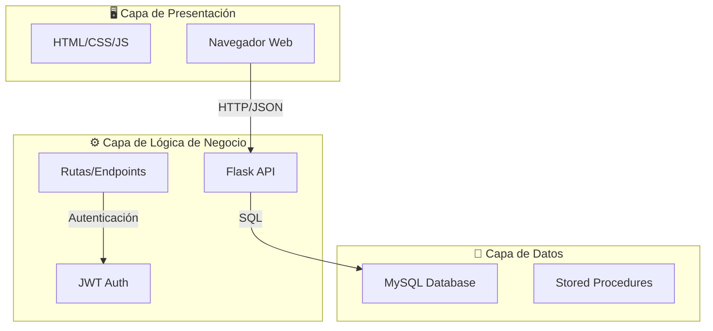

# 🎬 CineMax - Sistema de Gestión de Cine

## 📋 Descripción del Sistema

CineMax es una aplicación web completa para la gestión de un cine, desarrollada como proyecto académico para el Taller de Desarrollo de Software. El sistema permite a los usuarios consultar la cartelera, comprar tiquetes en línea y a los administradores gestionar películas, funciones y validar entradas.

### Propósito
Facilitar la compra de boletos de cine de manera digital, optimizando la experiencia del cliente y proporcionando herramientas administrativas para el control de ventas y ocupación de salas.

### Objetivos
- Automatizar el proceso de compra de tiquetes
- Proporcionar visibilidad en tiempo real de la ocupación de salas
- Ofrecer reportes administrativos de ventas
- Simplificar la validación de tiquetes en taquilla

### Alcance
- Gestión de películas y cartelera
- Programación de funciones por fecha y hora
- Selección interactiva de asientos
- Compra de tiquetes con generación de códigos únicos
- Dashboard administrativo con estadísticas
- Validación de tiquetes para control de acceso

---

## 🛠️ Tecnologías Utilizadas

### Backend
| Tecnología | Versión | Propósito |
|------------|---------|-----------|
| **Flask** | 3.0.3 | Framework web principal |
| **Flask-CORS** | 4.0.0 | Habilitar CORS para comunicación frontend-backend |
| **Flask-JWT-Extended** | 4.6.0 | Autenticación con tokens JWT |
| **PyMySQL** | 1.1.0 | Conector para base de datos MySQL |
| **python-dotenv** | 1.0.1 | Gestión de variables de entorno |
| **Werkzeug** | 3.0.1 | Utilidades WSGI y hashing de contraseñas |

### Base de Datos
| Tecnología | Propósito |
|------------|-----------|
| **MySQL** | Sistema de gestión de base de datos relacional |

### Frontend
| Tecnología | Propósito |
|------------|-----------|
| **HTML5** | Estructura de las páginas web |
| **CSS3** | Estilos y diseño responsivo |
| **JavaScript (Vanilla)** | Lógica del cliente y comunicación con API |
| **Google Fonts (Inter)** | Tipografía moderna |

---

## 🏗️ Arquitectura del Sistema

El sistema sigue una **arquitectura de 3 capas** clásica:



### Detalle de Capas

| Capa | Componentes | Responsabilidad |
|------|-------------|-----------------|
| **Presentación** | HTML, CSS, JS | Interfaz de usuario, validaciones cliente, consumo de API |
| **Lógica** | Flask, Blueprints | Procesamiento de negocio, autenticación, validaciones |
| **Datos** | MySQL, PyMySQL | Persistencia, integridad referencial, consultas |

---

## 📁 Estructura del Proyecto

```
Sistema-Web-para-Gestion-de-Cine/
│
├── 📂 backend/                  # API REST Flask
│   ├── 📄 app.py               # Punto de entrada de la aplicación
│   ├── 📄 config.py            # Configuración de la aplicación
│   ├── 📄 db.py                # Conexión a base de datos
│   ├── 📄 init_db.py           # Script de inicialización de BD
│   ├── 📄 requirements.txt     # Dependencias Python
│   └── 📂 routes/              # Blueprints de rutas
│       ├── 📄 __init__.py
│       ├── 📄 auth.py          # Autenticación (login/register)
│       ├── 📄 peliculas.py     # CRUD de películas
│       ├── 📄 funciones.py     # Gestión de funciones y asientos
│       ├── 📄 tiquetes.py      # Compra y validación de tiquetes
│       └── 📄 admin.py         # Endpoints administrativos
│
├── 📂 database/                 # Scripts de base de datos
│   └── 📄 schema.sql           # Esquema completo de la BD
│
├── 📂 frontend/                 # Aplicación cliente
│   ├── 📄 index.html           # Página principal / Cartelera
│   ├── 📄 login.html           # Inicio de sesión
│   ├── 📄 registro.html        # Registro de usuarios
│   ├── 📄 compra.html          # Selección de asientos
│   ├── 📄 admin.html           # Panel de administración
│   ├── 📄 validacion.html      # Validador de tiquetes
│   ├── 📂 css/
│   │   └── 📄 styles.css       # Estilos globales
│   └── 📂 js/
│       └── 📄 app.js           # Utilidades JavaScript
│
└── 📂 docs/                     # Documentación técnica
    ├── 📄 README.md            # Este documento
    ├── 📄 DIAGRAMA_ER.md       # Modelo de base de datos
    ├── 📄 API.md               # Documentación de endpoints
    └── 📄 MANUAL_USUARIO.md    # Guía de uso
```

---

## ⚙️ Instalación y Configuración

### Prerrequisitos
- Python 3.8+
- MySQL 5.7+
- Navegador web moderno

### Paso 1: Clonar el Repositorio
```bash
git clone <url-del-repositorio>
cd Sistema-Web-para-Gestion-de-Cine
```

### Paso 2: Configurar Base de Datos
```bash
# Acceder a MySQL
mysql -u root -p

# Ejecutar el script de esquema
source database/schema.sql
```

### Paso 3: Configurar Backend
```bash
cd backend

# Crear entorno virtual (opcional pero recomendado)
python -m venv venv

# Activar entorno virtual
# Windows:
venv\Scripts\activate
# Linux/Mac:
source venv/bin/activate

# Instalar dependencias
pip install -r requirements.txt
```

### Paso 4: Configurar Variables de Entorno
Crear archivo `.env` en la carpeta `backend/`:
```env
MYSQL_HOST=localhost
MYSQL_USER=root
MYSQL_PASSWORD=tu_contraseña
MYSQL_DB=cine_db
SECRET_KEY=tu-clave-secreta
```

### Paso 5: Iniciar el Servidor
```bash
# Desde la carpeta backend
python app.py
```
El servidor iniciará en `http://localhost:5000`

### Paso 6: Acceder al Frontend
Abrir el archivo `frontend/index.html` en el navegador o servir con un servidor estático:
```bash
cd frontend
# Python 3
python -m http.server 5500
```

---

## ✨ Características Implementadas

### 👥 Para Clientes
| Característica | Descripción |
|----------------|-------------|
| 🎬 **Cartelera** | Visualización de películas disponibles con funciones |
| 🔍 **Detalle de Película** | Información completa: título, género, clasificación, imagen |
| 🪑 **Selección de Asientos** | Mapa interactivo de la sala con disponibilidad en tiempo real |
| 🛒 **Compra de Tiquetes** | Proceso de compra con generación de código único |
| 🔐 **Autenticación** | Registro e inicio de sesión con JWT |
| 🎫 **Validación de Tiquetes** | Verificación de validez de códigos QR/Tiquetes |

### 🔧 Para Administradores
| Característica | Descripción |
|----------------|-------------|
| 📊 **Dashboard** | Resumen de ventas totales y ocupación de funciones |
| 🎬 **Gestión de Películas** | CRUD completo de películas en cartelera |
| 📅 **Gestión de Funciones** | Programación, edición y cancelación de funciones |
| 📈 **Reportes de Ventas** | Estadísticas por día, película más vista |
| ✅ **Validación** | Sistema de validación de tiquetes en taquilla |

---

## 🔒 Seguridad

- **Autenticación JWT**: Tokens seguros con expiración
- **Hash de Contraseñas**: Uso de Werkzeug para encriptación
- **Validación de Entradas**: Sanitización en backend
- **CORS Configurado**: Control de acceso entre orígenes
- **SQL Injection Prevention**: Uso de consultas parametrizadas

---

## 📝 Notas Adicionales

- El sistema incluye un usuario administrador por defecto:
  - Email: `admin@cine.com`
  - Contraseña: `admin123`
- La sala de cine tiene capacidad de **150 asientos** (10 filas × 15 columnas)
- Los códigos de tiquete son generados automáticamente en formato UUID reducido

---

**Desarrollado para:** Taller de Desarrollo de Software  
**Tecnológico de Antioquia - 2024**
